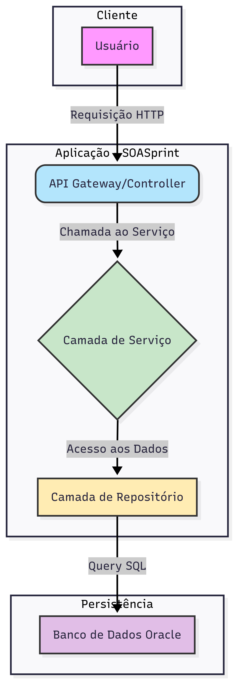

# SOASprint: Projeto de Gestão de Perfil e Carteira

### Descrição do Projeto
O **SOASprint** é uma aplicação desenvolvida com foco em **Arquitetura Orientada a Serviços (SOA)**, que visa gerenciar perfis de usuário e suas respectivas carteiras financeiras. A aplicação é dividida em serviços específicos, garantindo a separação de responsabilidades e a escalabilidade. O projeto segue as melhores práticas de desenvolvimento, com código limpo, camadas bem definidas e comunicação clara entre os componentes.

---

### Tecnologias Utilizadas
* **Linguagem:** Java
* **Framework:** Spring Boot
* **Banco de Dados:** Oracle SQL
* **Ferramentas:** Maven (Gerenciamento de dependências), Git (Controle de versão), Postman/Insomnia (Testes de API)

---

### Arquitetura e Diagramas

#### Diagrama de Camadas (Arquitetura)
O projeto é estruturado em camadas para garantir a separação de responsabilidades e facilitar a manutenção:
* **Controller:** Responsável por receber as requisições HTTP e roteá-las para a camada de serviço.
* **Service:** Contém a lógica de negócio da aplicação.
* **Repository:** Camada de acesso a dados, responsável pela comunicação com o banco de dados.
* **Model/Entity:** Representação das entidades do banco de dados.
* **DTO (Data Transfer Object):** Objetos utilizados para transferir dados entre as camadas, garantindo a segurança e o encapsulamento.



---

#### Diagrama de Entidades (ERD)
O modelo de dados é simples e eficiente, composto por duas entidades principais: `Profile` e `Wallet`.

* **`PROFILES`**: Armazena informações do perfil do usuário.
    * `PROFILE_ID` (PK): Identificador único.
    * `USER_ID`: Identificador de login.
    * `EMAIL`: E-mail do usuário (único).
    * `FIRST_NAME`: Nome.
    * `LAST_NAME`: Sobrenome.
* **`WALLETS`**: Armazena o saldo da carteira, vinculado a um perfil.
    * `WALLET_ID` (PK): Identificador único.
    * `PROFILE_ID` (FK): Chave estrangeira que referencia a tabela `PROFILES`.
    * `BALANCE`: Saldo atual.

---

### Configuração e Execução do Projeto

1.  **Pré-requisitos:** Certifique-se de ter o **JDK 17+** e o **Maven** instalados em sua máquina.
2.  **Clone o repositório:**
    ```bash
    git clone [https://github.com/LeoViBo/SOASprint.git](https://github.com/LeoViBo/SOASprint.git)
    cd SOASprint
    ```
3.  **Configuração do Banco de Dados:**
    * Acesse o arquivo `src/main/resources/application.properties`.
    * Configure as credenciais e a URL de conexão com seu banco de dados Oracle.
    ```properties
    spring.datasource.url=jdbc:oracle:thin:@//localhost:1521/SEU_SID
    spring.datasource.username=SEU_USUARIO
    spring.datasource.password=SUA_SENHA
    spring.jpa.hibernate.ddl-auto=none
    spring.jpa.show-sql=true
    ```
4.  **Execução:**
    * Inicie a aplicação através da sua IDE ou por linha de comando:
    ```bash
    ./mvnw spring-boot:run
    ```
    A aplicação estará disponível em `http://localhost:8080`.

---

### Exemplos de Requisições

Use uma ferramenta como **Postman** ou **Insomnia** para testar os endpoints da API.

#### 1. Criar um novo Perfil
* **Endpoint:** `POST /profiles`
* **Body (JSON):**
    ```json
    {
      "firstName": "Jane",
      "lastName": "Doe",
      "email": "jane.doe@example.com"
    }
    ```
* **Resposta (Status 201 Created):**
    ```json
    {
      "id": 1,
      "firstName": "Jane",
      "lastName": "Doe",
      "email": "jane.doe@example.com",
      "createdAt": "2025-09-20T10:00:00"
    }
    ```

---

#### 2. Obter informações de um Perfil
* **Endpoint:** `GET /profiles/{id}`
* **Exemplo:** `GET /profiles/1`
* **Resposta (Status 200 OK):**
    ```json
    {
      "id": 1,
      "firstName": "Jane",
      "lastName": "Doe",
      "email": "jane.doe@example.com",
      "createdAt": "2025-09-20T10:00:00"
    }
    ```

---

#### 3. Obter saldo da Carteira
* **Endpoint:** `GET /wallets/{profileId}`
* **Exemplo:** `GET /wallets/1`
* **Resposta (Status 200 OK):**
    ```json
    {
      "walletId": 1,
      "profileId": 1,
      "balance": 150.75
    }
    ```

---

#### 4. Atualizar o saldo da Carteira (Adicionar fundos)
* **Endpoint:** `POST /wallets/{profileId}/deposit`
* **Body (JSON):**
    ```json
    {
      "amount": 50.00
    }
    ```
* **Resposta (Status 200 OK):**
    ```json
    {
      "walletId": 1,
      "profileId": 1,
      "balance": 200.75
    }
    ```